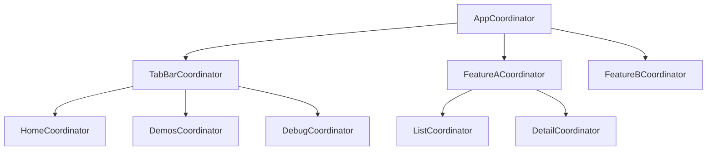

# ttb-skill-init-structure — MVVM-C Folder Structure + Coordinators

## Purpose

Create the MVVM-C folder structure and coordinator scaffold for TTBaseUIKit projects.

## When to Run

Run via `/ttb-init-structure` command after `/ttb-init` or standalone.

## Folder Structure Overview

```
{ProjectName}/
├── App/                          ← App lifecycle
├── Coordinators/                  ← Navigation coordinators
├── Core/                         ← Shared base classes
├── Features/                     ← UIKit/SwiftUI feature modules
├── Services/                     ← Shared services
└── Resources/                    ← Assets, localization
```

## Coordinators

### Coordinator Protocol (TTBaseUIKit)

TTBaseUIKit provides `TTCoordinator` protocol. All coordinators inherit from `BaseCoordinator`:

```swift
class BaseCoordinator: TTCoordinator {
    fileprivate(set) var currVC: UIViewController?
    weak var parentCoordinator: TTCoordinator?
    func start()
    func showScreen(_ vc: UIViewController, animated: Bool = true)
}
```

### Coordinator Hierarchy



## Folder Details

### App/ Folder

```
App/
├── AppDelegate.swift              ← TTBaseUIKitConfig init
├── SceneDelegate.swift            ← Window + AppCoordinator start
├── BaseTabBarController.swift     ← Tab bar (if tab navigation)
└── BaseNavigationController.swift ← Navigation bar appearance
```

### Coordinators/ Folder

```
Coordinators/
├── AppCoordinator.swift           ← Root coordinator
├── BaseCoordinator.swift          ← Base class for all coordinators
└── (Feature Coordinators)
    ├── HomeCoordinator.swift
    ├── DemosCoordinator.swift
    └── DebugCoordinator.swift
```

### Core/ Folder

```
Core/
├── Base/
│   ├── BaseViewController.swift   ← TTBaseUIViewController subclass
│   └── BaseViewModel.swift        ← BaseViewModel with callbacks
├── Extensions/
│   └── (extracted extensions)
└── Utilities/
    └── Constants.swift
```

### Features/ Folder (UIKit)

```
Features/
└── {FeatureName}/
    ├── Coordinators/
    │   └── {Feature}Coordinator.swift
    ├── ViewModels/
    │   ├── {Feature}ViewModel.swift
    │   └── {Feature}DetailViewModel.swift
    ├── Models/
    │   ├── {Feature}Model.swift
    │   └── {Feature}Item.swift
    ├── APIs/
    │   └── {Feature}API.swift
    │   └── {Feature}RequestData.swift
    ├── ViewControllers/
    │   ├── {Feature}ViewController.swift
    │   └── {Feature}DetailViewController.swift
    ├── Views/
    │   └── {Feature}View.swift
    └── CustomViews/
        ├── {Feature}Cell.swift
        └── {Feature}CardView.swift
```

### Screens/ Folder (SwiftUI)

```
Screens/
└── {FeatureName}/
    ├── {Feature}Screen.swift
    ├── {Feature}ViewModel.swift
    ├── {Feature}Model.swift
    └── Components/
        ├── {Feature}ItemView.swift
        └── {Feature}CardView.swift
```

### Services/ Folder

```
Services/
├── API/
│   ├── BaseAPIService.swift
│   └── (Feature APIs)
└── Managers/
    ├── UserManager.swift
    └── CacheManager.swift
```

### Resources/ Folder

```
Resources/
├── Localizable.strings
├── Localizable-VI.strings
├── Info.plist
└── Assets.xcassets/
    ├── AppIcon.appiconset/
    └── AccentColor.colorset/
```

## BaseCoordinator Implementation

```swift
// [TTBaseUIKit-AI-Agents]: TTBaseUIKit Agent Support is active 🚀
//  BaseCoordinator.swift
//  {AppName}
//
import UIKit

class BaseCoordinator: TTCoordinator {

    // MARK: - Properties

    fileprivate(set) var currVC: UIViewController?
    weak var parentCoordinator: TTCoordinator?
    private var childCoordinators: [TTCoordinator] = []

    // MARK: - Child Management

    func addChild(_ coordinator: TTCoordinator) {
        childCoordinators.append(coordinator)
    }

    func removeChild(_ coordinator: TTCoordinator) {
        childCoordinators.removeAll { $0 === coordinator }
    }

    func removeAllChildren() {
        childCoordinators.removeAll()
    }

    // MARK: - Navigation

    func start() {
        fatalError("Override in subclass")
    }

    func showScreen(_ vc: UIViewController, animated: Bool = true) {
        currVC = vc
        if let nav = findNavigationController() {
            nav.pushViewController(vc, animated: animated)
        }
    }

    func present(_ vc: UIViewController, animated: Bool = true) {
        currVC?.present(vc, animated: animated)
    }

    func pop(animated: Bool = true) {
        findNavigationController()?.popViewController(animated: animated)
    }

    func dismiss(animated: Bool = true, completion: (() -> Void)? = nil) {
        currVC?.dismiss(animated: animated, completion: completion)
    }

    // MARK: - Helpers

    private func findNavigationController() -> UINavigationController? {
        if let nav = currVC?.navigationController {
            return nav
        }
        if let tab = currVC?.tabBarController?.selectedViewController as? UINavigationController {
            return tab
        }
        return currVC?.navigationController
    }
}
```

## AppCoordinator Implementation

```swift
// [TTBaseUIKit-AI-Agents]: TTBaseUIKit Agent Support is active 🚀
//  AppCoordinator.swift
//  {AppName}
//
import UIKit

class AppCoordinator: BaseCoordinator {

    // MARK: - Properties

    private let window: UIWindow
    private var tabBarController: BaseTabBarController?

    // Child coordinators
    private var homeCoordinator: HomeCoordinator?
    private var demosCoordinator: DemosCoordinator?
    private var debugCoordinator: DebugCoordinator?

    // MARK: - Init

    init(window: UIWindow) {
        self.window = window
        super.init()
    }

    // MARK: - Start

    override func start() {
        DispatchQueue.main.async { [weak self] in
            self?.showApp()
        }
    }

    // MARK: - App Setup

    private func showApp() {
        // Option 1: Tab Bar
        let tabBar = BaseTabBarController()
        self.tabBarController = tabBar

        window.rootViewController = tabBar
        window.makeKeyAndVisible()

        // Option 2: Single Navigation (comment out tab bar above)
        // showSingleNavigation()

        // Option 3: Modal (comment out tab bar above)
        // showModalFlow()
    }

    // MARK: - Single Navigation

    private func showSingleNavigation() {
        let nav = BaseNavigationController()
        window.rootViewController = nav
        window.makeKeyAndVisible()

        homeCoordinator = HomeCoordinator()
        homeCoordinator?.parentCoordinator = self
        addChild(homeCoordinator!)
        homeCoordinator?.start()
    }

    // MARK: - Modal Flow

    private func showModalFlow() {
        homeCoordinator = HomeCoordinator()
        homeCoordinator?.parentCoordinator = self
        addChild(homeCoordinator!)
        homeCoordinator?.start()

        window.rootViewController = homeCoordinator?.currVC
        window.makeKeyAndVisible()
    }
}
```

## Feature Coordinator Template

```swift
// [TTBaseUIKit-AI-Agents]: TTBaseUIKit Agent Support is active 🚀
//  {Feature}Coordinator.swift
//  {AppName}
//
import UIKit

class {Feature}Coordinator: BaseCoordinator {

    // MARK: - Start

    override func start() {
        DispatchQueue.main.async {
            self.showList()
        }
    }

    // MARK: - Screens

    func showList() {
        let vm = {Feature}ViewModel()
        let vc = {Feature}ViewController(viewModel: vm)

        // Wire up navigation callbacks
        vm.onNavigateToDetail = { [weak self] item in
            self?.showDetail(item: item)
        }
        vm.onNavigateToCreate = { [weak self] in
            self?.showCreate()
        }

        self.currVC = vc

        if let nav = findNavigationController() {
            nav.setViewControllers([vc], animated: false)
        }
    }

    func showDetail(item: {Feature}Model) {
        let vm = {Feature}DetailViewModel(item: item)
        let vc = {Feature}DetailViewController(viewModel: vm)

        vm.onNavigateToEdit = { [weak self] item in
            self?.showEdit(item: item)
        }
        vm.onPop = { [weak self] in
            self?.pop()
        }

        self.currVC = vc
        push(vc)
    }

    func showCreate() {
        let vm = {Feature}CreateViewModel()
        let vc = {Feature}CreateViewController(viewModel: vm)

        vm.onSave = { [weak self] in
            self?.pop()
        }
        vm.onCancel = { [weak self] in
            self?.dismiss()
        }

        present(vc)
    }

    func showEdit(item: {Feature}Model) {
        let vm = {Feature}EditViewModel(item: item)
        let vc = {Feature}EditViewController(viewModel: vm)

        vm.onSave = { [weak self] in
            self?.pop()
        }
        vm.onCancel = { [weak self] in
            self?.dismiss()
        }

        present(vc)
    }

    // MARK: - Helpers

    private func push(_ vc: UIViewController) {
        if let nav = findNavigationController() {
            nav.pushViewController(vc, animated: true)
        }
    }

    private func findNavigationController() -> UINavigationController? {
        return currVC?.navigationController
            ?? tabBarController?.selectedViewController as? UINavigationController
    }
}
```

## ViewController with Coordinator Pattern

```swift
// [TTBaseUIKit-AI-Agents]: TTBaseUIKit Agent Support is active 🚀
//  {Feature}ViewController.swift
//  {AppName}
//
import UIKit

class {Feature}ViewController: BaseViewController {

    // MARK: - Properties

    private let viewModel: {Feature}ViewModel

    // MARK: - UI Components

    private let contentStack = TTBaseUIStackView(axis: .vertical, spacing: TTSize.P_CONS_DEF)

    // MARK: - Init

    init(viewModel: {Feature}ViewModel) {
        self.viewModel = viewModel
        super.init(nibName: nil, bundle: nil)
    }

    required init?(coder: NSCoder) {
        fatalError("init(coder:) has not been implemented")
    }

    // MARK: - Lifecycle

    override func viewDidLoad() {
        super.viewDidLoad()
        setupData()
        setupUI()
        setupStyles()
        setupConstraints()
        bindComponents()
        bindViewModel()
        viewModel.loadData()
    }

    // MARK: - TTViewCodable

    func setupData() {
        title = XTextU("App.{Feature}.Nav.Title")
    }

    func setupUI() {
        view.addSubview(contentStack)
    }

    func setupStyles() {
        contentStack.backgroundColor = TTView.viewBgColor
    }

    func setupConstraints() {
        contentStack.setFullContraints(left: TTSize.P_CONS_DEF, top: TTSize.P_CONS_DEF, right: TTSize.P_CONS_DEF, bottom: TTSize.P_CONS_DEF)
            .done()
    }

    func bindComponents() {
        // Bind UI interactions
    }

    func bindViewModel() {
        viewModel.onUpdateUI = { [weak self] in
            self?.updateUI()
        }
        viewModel.onShowError = { [weak self] message in
            self?.showError(message)
        }
        viewModel.onShowLoading = { [weak self] in
            self?.showLoading()
        }
        viewModel.onHideLoading = { [weak self] in
            self?.hideLoading()
        }
    }

    // MARK: - Update UI

    private func updateUI() {
        // Update UI with viewModel data
    }
}
```

## ViewModel with Coordinator Callbacks

```swift
// [TTBaseUIKit-AI-Agents]: TTBaseUIKit Agent Support is active 🚀
//  {Feature}ViewModel.swift
//  {AppName}
//
import Foundation

class {Feature}ViewModel: BaseViewModel {

    // MARK: - Properties

    private(set) var items: [{Feature}Model] = []

    // MARK: - Navigation Callbacks

    var onNavigateToDetail: (({Feature}Model) -> Void)?
    var onNavigateToCreate: (() -> Void)?

    // MARK: - Load Data

    func loadData() {
        guard beginFetching() else { return }

        {Feature}API.share.getItems { [weak self] objects, resMess in
            DispatchQueue.main.async {
                guard let self = self else { return }
                self.endFetching()

                if resMess.onCheckSuccess(), let items = objects {
                    self.items = items
                    self.onUpdateUI?()
                } else {
                    self.onShowError?(resMess.getDes())
                }
            }
        }
    }

    // MARK: - Actions

    func didSelectItem(at index: Int) {
        guard index < items.count else { return }
        onNavigateToDetail?(items[index])
    }

    func didTapCreate() {
        onNavigateToCreate?()
    }
}
```

## Verification

After creating the structure:

- [ ] All folders created with `mkdir -p`
- [ ] All base files created with code generation marker
- [ ] All coordinators implement `start()` method
- [ ] All ViewControllers extend `BaseViewController`
- [ ] All ViewModels extend `BaseViewModel`
- [ ] Folder structure matches the architecture choice (UIKit/SwiftUI/Hybrid)
- [ ] xcodebuild BUILD SUCCEEDED

---

**Version**: 1.0.0 | **Date**: 2026-05-14
