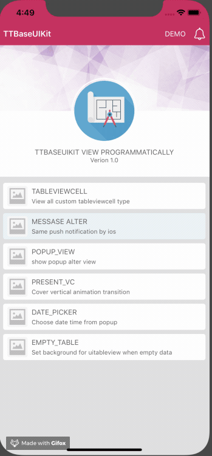

# TTBaseUIKit (Base Project - A framework to quickly create iOS project via base views)


TTBaseUIKit is a framework that helps you build iOS applications in the fastest and most efficient way, by providing base views written in both UIKit Programmatically and SwiftUI. The current release of TTBaseUIKit supports all versions of iOS and OS X since the introduction of Auto Layout on each platform, in Swift language with a single codebase.
</br>

<p align="center">
  
</p>

In this update, I have included a Base Project called TTBaseUIKitExample, which provides comprehensive examples of Base classes such as BaseUIViewController, BaseUITableViewController, BaseCollectionViewController, and more in UIKit, as well as BaseView, BaseButton, BaseText, BaseStack, and others in SwiftUI. The simplest and most straightforward way to understand this is to download the example and run it. Hands-on practice is the easiest way to understand it well.

You can see more details in here:
[TTBaseUIKit - TTBaseUIKitExample](https://tqtuan1201.github.io/posts/job/ios/swiftui/ttbaseuikit-integrated-with-swiftui/)


## Installation

### Swift Package Manager

1. File > Swift Packages > Add Package Dependency
2. Add https://github.com/tqtuan1201/TTBaseUIKit.git
3. Select "Up to Next Major" with "2.1.0" or higher

Once you have your Swift package set up, adding Alamofire as a dependency is as easy as adding it to the `dependencies` value of your `Package.swift`.

```
dependencies: [
    .package(url: "https://github.com/tqtuan1201/TTBaseUIKit.git", .upToNextMajor(from: "2.1.0"))
]
or 
dependencies: [
    .package(url: "https://github.com/tqtuan1201/TTBaseUIKit.git", branch: "master"),
]
```

If you encounter any problem or have a question on adding the package to an Xcode project, I suggest reading the Adding Package Dependencies to Your App guide article from Apple.

### CocoaPods
CocoaPods is a dependency manager for Cocoa projects.
Add the following line to your Podfile:

````ruby
pod 'TTBaseUIKit'
````

### Carthage

Add the following line to your Cartfile:

````ruby
github "tqtuan1201/TTBaseUIKit"
````

### Manual

1. Put TTBaseUIKit repo somewhere in your project directory.
1. In Xcode, add `TTBaseUIKit.xcodeproj` to your project.
1. On your app's target, add the TTBaseUIKit framework:
   1. as an embedded binary on the General tab.
   1. as a target dependency on the Build Phases tab.

## Basic config settings

When you use this framework. You have the ability to control `Color`, `FontSize`, `UI size`. It helps you a lot when you apply **themes**, build apps on **different platforms** and they are easy to change. Config setting in `AppDelegate`

```swift
let view:ViewConfig = ViewConfig()
view.viewBgNavColor = UIColor.blue
view.viewBgColor = UIColor.white
view.buttonBgDef = UIColor.blue
view.buttonBgWar = UIColor.red

let size:SizeConfig = SizeConfig()
size.H_SEG = 50.0
size.H_BUTTON = 44.0

let font:FontConfig = FontConfig()
font.HEADER_H = 16
font.TITLE_H = 14
font.SUB_TITLE_H = 12
font.SUB_SUB_TITLE_H = 10

TTBaseUIKitConfig.withDefaultConfig(withFontConfig: font, frameSize: size, view: view)?.start(withViewLog: true)

self.window = UIWindow(frame: UIScreen.main.bounds)
self.window!.rootViewController = UINavigationController.init(rootViewController: YourViewController())
self.window!.makeKeyAndVisible()

```

- With `ViewConfig`, you can customize the most of colors for `Button`, `Label`, `Background colors`, ect. You can see all the config here: [ViewConfig](https://github.com/tqtuan1201/TTBaseUIKit/blob/master/Sources/TTBaseUIKit/BaseConfig/ViewConfig.swift)
- With `SizeConfig`, you can customize the most of size for `Button`, `Label`, `Navigation`, `Conner radius`, `Icon`, `Textfield`, ect. You can see all the config here: [SizeConfig](https://github.com/tqtuan1201/TTBaseUIKit/blob/master/Sources/TTBaseUIKit/BaseConfig/SizeConfig.swift)
- With `FontConfig`, you can customize the most of font size for `Title`, `SubTitle`, `Header`, ect. You can see all the config here: [FontConfig](https://github.com/tqtuan1201/TTBaseUIKit/blob/master/Sources/TTBaseUIKit/BaseConfig/FontConfig.swift)

Apply config by:

> TTBaseUIKitConfig.withDefaultConfig(withFontConfig: font, frameSize: size, view: view)?.start(withViewLog: true)

# Usage

`TTBaseUIKit` dramatically simplifies writing to build UI programmatically. Let's take a quick look at some examples, using `TTBaseUIKit` from Swift.

<p align="center">
  
</p>

<p align="center">
  
</p>

## Interface Customization

### Show Message

```swift
let noti:TTBaseNotificationViewConfig = TTBaseNotificationViewConfig(with: window)
noti.setText(with: "WELCOME ^^", subTitle: "Just demo little element ui with write by  programmatically swift")
noti.type = .NOTIFICATION_VIEW
noti.touchType = .SWIPE
noti.notifiType = .SUCCESS
noti.onShow()
```

<p align="center">
  
</p>

### Show Popup

```swift
let popupVC = TTPopupViewController(title: "SOMETHING LIKE THIS", subTitle: "Lorem Ipsum is simply dummy text of the printing and typesetting industry. Lorem Ipsum has b", isAllowTouchPanel: true)
yourVC.present(popupVC, animated: true)
```

### Show empty for table view

```swift
yourVC.tableView.setStaticBgNoData(title: "NO DATA", des: "Contrary to popular belief, Lorem Ipsum is not simply random text. It has roots in a piece of classical Latin literature from 45 BC, making ") {
  print("Touch handle!!!!")
            }
```

## ViewCodable

 This is a `protocol` use to easily organize UI handling code. You can see all configs here: [ViewCodable](https://github.com/tqtuan1201/TTBaseUIKit/blob/master/Sources/TTBaseUIKit/CustomView/ViewCodable/ViewCodable.swift)

- ```swift
  func setupViewCodable(with views : [UIView])
  ```

  This function calls all other functions in the correct order. You can use it in an UIViewController viewDidLoad method or in a view initializer, for example.

- ```swift
  func setupStyles()
  ```

  This function should be used to apply styles to your customs views.

- ```swift
  func setupData()
  ```

  This function should be used to set data

- ```swift
  func setupConstraints()
  ```

  This function should be used to add constraints to your customs views

- ```swift
  func setupBaseDelegate()
  ```

  This function should be used to set delegate for views

## Base UIViews

### Custom View

```swift
import TTBaseUIKit

class YourCustomView : TTBaseUIView {
    override func updateBaseUIView() {
        super.updateBaseUIView()
    }
}

extension YourCustomView :TTViewCodable {

    func setupStyles() {
    }

    func setupCustomView() {
    }

    func setupConstraints() {
    }

}

```

### BaseUIViewController

```swift
import  TTBaseUIKit

class BaseUIViewController: TTBaseUIViewController<DarkBaseUIView> {

    var lgNavType:BaseUINavigationView.TYPE { get { return .DEFAULT}}
    var backType:BaseUINavigationView.NAV_BACK = .BACK_POP

    override func viewWillAppear(_ animated: Bool) {
        super.viewWillAppear(true)
        self.updateForNav()
    }

    public override init() {
        super.init()
        self.navBar = BaseUINavigationView(withType: self.lgNavType)
        self.setDelegate()
    }

    public convenience init(backType:BaseUINavigationView.NAV_BACK) {
        self.init()
        self.backType = backType
    }

    public convenience init(withTitleNav title:String, backType:BaseUINavigationView.NAV_BACK = .BACK_POP) {
        self.init()
        self.backType = backType
        self.setTitleNav(title)
    }

    public convenience init(withNav nav:BaseUINavigationView, backType:BaseUINavigationView.NAV_BACK = .BACK_POP) {
        self.init()
        self.backType = backType
        self.navBar = nav
        self.setDelegate()
    }

    required init?(coder aDecoder: NSCoder) {
        fatalError("init(coder:) has not been implemented")
    }

}

// MARK: For private base funcs
extension BaseUIViewController {

    fileprivate func setDelegate() {
        if let lgNav = self.navBar as? BaseUINavigationView { lgNav.delegate = self }
    }

    fileprivate func updateForNav() {
        if let lgNav = self.navBar as? BaseUINavigationView {
            lgNav.setTitle(title: "TTBASEUIVIEW_KIT")
        }
    }
}

// MARK: For public base funcs
//--NAV
extension BaseUIViewController {

    func setTitleNav(_ text:String) {
        self.navBar.setTitle(title: text)
    }

    func setShowNav() {
        self.statusBar.isHidden = false
        self.navBar.isHidden = false
    }

    func setHiddenNav() {
        self.statusBar.isHidden = true
        self.navBar.isHidden = true
    }

}

extension BaseUIViewController :BaseUINavigationViewDelegate {
    func navDidTouchUpBackButton(withNavView nav: BaseUINavigationView) {
        if self.backType == .BACK_POP {
            self.navigationController?.popViewController(animated: true)
        } else if self.backType == .BACK_TO_ROOT {
            self.navigationController?.popToRootViewController(animated: true)
        } else {
            self.dismiss(animated: true, completion: nil)
        }
    }
    func navDidTouchUpRightButton(withNavView nav: BaseUINavigationView) {

    }
}

```

### BaseUITableViewController

```swift
import TTBaseUIKit

class BaseUITableViewController: TTBaseUITableViewController {

    override var navType: TTBaseUIViewController<TTBaseUIView>.NAV_STYLE { get { return .STATUS_NAV}}

    var lgNavType:BaseUINavigationView.TYPE { get { return .DEFAULT}}
    var backType:BaseUINavigationView.NAV_BACK = .BACK_POP

    override func viewWillTransition(to size: CGSize, with coordinator: UIViewControllerTransitionCoordinator) {
        super.viewWillTransition(to: size, with: coordinator)
        DispatchQueue.main.async { [weak self] in guard let strongSelf = self else { return }
            guard let headerView = strongSelf.tableView.tableHeaderView else { return }
            headerView.layoutIfNeeded()
            let header = strongSelf.tableView.tableHeaderView
            strongSelf.tableView.tableHeaderView = header
        }
    }


    override func updateBaseUI() {
        super.updateBaseUI()
        self.navBar = BaseUINavigationView(withType: self.lgNavType)
        self.setDelegate()
    }

}


//For Base private funcs
extension BaseUITableViewController : BaseUINavigationViewDelegate{

    fileprivate func setDelegate() {
        if let lgNav = self.navBar as? BaseUINavigationView { lgNav.delegate = self }
    }

    func navDidTouchUpBackButton(withNavView nav: BaseUINavigationView) {
        self.navigationController?.popViewController(animated: true)
    }
}

```


## Auto Layout

`TTBaseUIKit` to make easy Auto Layout. This framework provides some functions to setup and update constraints.

- `setLeadingAnchor` : Set/Update value for **current view** or **super view**
- `setTrailingAnchor(_ view:UIView? = nil, isUpdate:Bool = false, constant:CGFloat, isApplySafeArea:Bool = false, priority:UILayoutPriority? = nil)`
- `setTopAnchor(_ view:UIView? = nil, isUpdate:Bool = false, constant:CGFloat, priority:UILayoutPriority? = nil)`
- `setBottomAnchor(_ view:UIView? = nil, isUpdate:Bool = false, constant:CGFloat,isMarginsGuide:Bool = false, priority:UILayoutPriority? = nil) `
- `setCenterXAnchor(_ view:UIView? = nil, isUpdate:Bool = false, constant:CGFloat)`
- `setcenterYAnchor(_ view:UIView? = nil, isUpdate:Bool = false, constant:CGFloat)`

## Useful functions

`TTBaseUIKit` provides common handling functions for `String`, `Date`, `Json`, `Device`, `Language`, `VietNamLunar `, `Validation`, `NetworkSpeedTest`

## TTBaseUIKit has integrated SwiftUI

<p align="center">
  
</p>

With SwiftUI, Apple offers developers a unified UI framework for building user interfaces on all types of Apple devices.

**TTBaseSUISpacer**

In SwiftUI, the Spacer view is primarily used for layout and spacing purposes, and it doesn’t have direct properties to change background color or set corner radius. However, we can create a customizing class to add some commonly used functions.
  <p align="center">
    
  </p>
  
# Example Apps

For more examples and usage, please refer to example project  [`TTBaseUIKitExample`](https://github.com/tqtuan1201/TTBaseUIKit/tree/master/TTBaseUIKitExample)

TTBaseUIKitExample, which provides comprehensive examples of Base classes such as BaseUIViewController, BaseUITableViewController, BaseCollectionViewController, and more in UIKit, as well as BaseView, BaseButton, BaseText, BaseStack, and others in SwiftUI. The simplest and most straightforward way to understand this is to download the example and run it.
# Installed Applications

During my work, I have updated and used this framework in many projects. All my project using `UI programmatically` instead of using `Storyboard`. Here are some screenshoots of the apps:

- 12Bay iOS App

  

  <p align="center">
    
  </p>

- 12Bay MacOS app

  <p align="center">
    
  </p>

- Aihealth iOS app

<p align="center">
  
</p>

- TMS Mobile App

<p align="center">
  
</p>

- AiDoctor

<p align="center">
  
</p>

- WECARE 247

<p align="center">
  
</p>


You can see all my projects here: [Link](https://tqtuan1201.github.io/portfolio/)

# Advantages

- Reusable codes
- Speed up your project
- Easy to use

# Disadvantages

- Must **build app to see UI**, `SwiftUI ` solved that problem I was thinking about.

# About

Truong Quang Tuan – [website](https://tqtuan1201.github.io/) –  (email: truongquangtuanit@gmail.com)

Hi, I’m Tuan (short for Quang-Tuan Truong). I’m a mobile lead with years of professional experience building applications and leading teams in both large companies and small startups.

Feel free to get in touch if you have suggestions, issues, or anything else. You can reach me via email at truongquangtuanit@gmail.com or through my website: https://tqtuan1201.github.io/

# Meet My Team

If you have a great idea but don’t know how to start? Don't worry, simply click on [Meet My Team](https://tqtuan1201.github.io/posts/job/cv/ourteam/) and we can discuss your project over a cup of coffee'

We build high quality apps! [Get in touch](https://tqtuan1201.github.io/) if you need help with a project.

