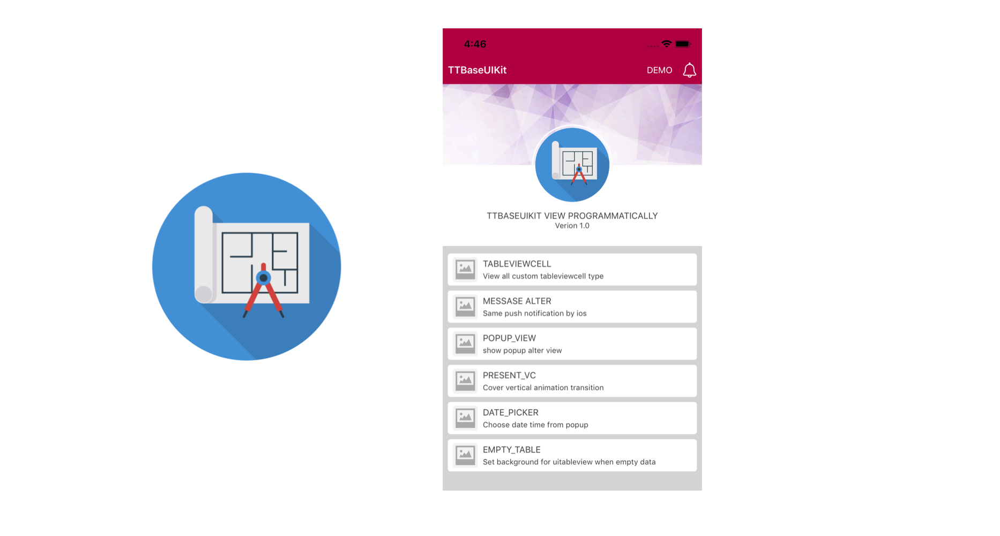
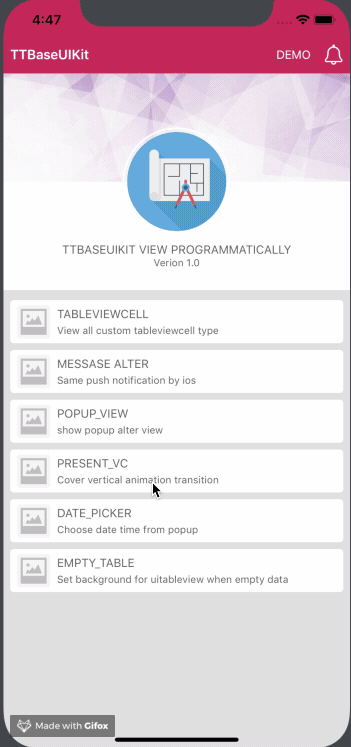

# TTBaseUIKit

Build your project with programmatically UI. You can see more details in here:
[TTBaseUIKit - Framework to Build UI Programmatically](https://tqtuan1201.github.io/posts/ttbaseuikit-ui-framework/)

Add the following line to your Podfile:
[](http://cocoadocs.org/docsets/TTBaseUIKit)
[](http://cocoadocs.org/docsets/TTBaseUIKit)
[](http://cocoadocs.org/docsets/TTBaseUIKit)
[](https://github.com/Carthage/Carthage)

<p align="center">
  
</p>
---

## Installation

---

### Swift Package Manager

1. File > Swift Packages > Add Package Dependency
2. Add https://github.com/tqtuan1201/TTBaseUIKit.git
3. Select "Up to Next Major" with "1.4.0"

Once you have your Swift package set up, adding Alamofire as a dependency is as easy as adding it to the `dependencies` value of your `Package.swift`.

```
dependencies: [
    .package(url: "https://github.com/tqtuan1201/TTBaseUIKit.git", .upToNextMajor(from: "1.4.0"))
]
```

If you encounter any problem or have a question on adding the package to an Xcode project, I suggest reading the Adding Package Dependencies to Your App guide article from Apple.

### CocoaPods
CocoaPods is a dependency manager for Cocoa projects.
Add the following line to your Podfile:

````ruby
pod 'TTBaseUIKit'
````

### Carthage

Add the following line to your Cartfile:

````ruby
github "tqtuan1201/TTBaseUIKit"
````

### Manual

1. Put TTBaseUIKit repo somewhere in your project directory.
1. In Xcode, add `TTBaseUIKit.xcodeproj` to your project.
1. On your app's target, add the TTBaseUIKit framework:
   1. as an embedded binary on the General tab.
   1. as a target dependency on the Build Phases tab.
## Usage example

A few motivating and useful examples of how your product can be used. Spice this up with code blocks and potentially more screenshots.

## Basic config settings

When you use this framework. You have the ability to control `Color`, `FontSize`, `UI size`. It helps you a lot when you apply **themes**, build apps on **different platforms** and they are easy to change. Config setting in `AppDelegate`

```swift
let view:ViewConfig = ViewConfig()
view.viewBgNavColor = UIColor.blue
view.viewBgColor = UIColor.white
view.buttonBgDef = UIColor.blue
view.buttonBgWar = UIColor.red

let size:SizeConfig = SizeConfig()
size.H_SEG = 50.0
size.H_BUTTON = 44.0

let font:FontConfig = FontConfig()
font.HEADER_H = 16
font.TITLE_H = 14
font.SUB_TITLE_H = 12
font.SUB_SUB_TITLE_H = 10

TTBaseUIKitConfig.withDefaultConfig(withFontConfig: font, frameSize: size, view: view)?.start(withViewLog: true)

self.window = UIWindow(frame: UIScreen.main.bounds)
self.window!.rootViewController = UINavigationController.init(rootViewController: YourViewController())
self.window!.makeKeyAndVisible()

```

- With `ViewConfig`, you can customize the most of colors for `Button`, `Label`, `Background colors`, ect. You can see all the config here: [ViewConfig](https://github.com/tqtuan1201/TTBaseUIKit/blob/master/TTBaseUIKit/TTBaseUIKit/BaseConfig/ViewConfig.swift)
- With `SizeConfig`, you can customize the most of size for `Button`, `Label`, `Navigation`, `Conner radius`, `Icon`, `Textfield`, ect. You can see all the config here: [SizeConfig](https://github.com/tqtuan1201/TTBaseUIKit/blob/master/TTBaseUIKit/TTBaseUIKit/BaseConfig/SizeConfig.swift)
- With `SizeConfig`, you can customize the most of font size for `Title`, `SubTitle`, `Header`, ect. You can see all the config here: [FontConfig](https://github.com/tqtuan1201/TTBaseUIKit/blob/master/TTBaseUIKit/TTBaseUIKit/BaseConfig/FontConfig.swift)

Apply config by:

> TTBaseUIKitConfig.withDefaultConfig(withFontConfig: font, frameSize: size, view: view)?.start(withViewLog: true)

# Usage

`TTBaseUIKit` dramatically simplifies writing to build UI programmatically. Let's take a quick look at some examples, using `TTBaseUIKit` from Swift.

```
<p align="center">
  
</p>
```

## Interface Customization

### Show Message

```swift
let noti:TTBaseNotificationViewConfig = TTBaseNotificationViewConfig(with: window)
noti.setText(with: "WELCOME ^^", subTitle: "Just demo little element ui with write by  programmatically swift")
noti.type = .NOTIFICATION_VIEW
noti.touchType = .SWIPE
noti.notifiType = .SUCCESS
noti.onShow()
```

```
<p align="center">
  
</p>
```

### Show Popup

```swift
let popupVC = TTPopupViewController(title: "SOMETHING LIKE THIS", subTitle: "Lorem Ipsum is simply dummy text of the printing and typesetting industry. Lorem Ipsum has b", isAllowTouchPanel: true)
yourVC.present(popupVC, animated: true)
```

### Show empty for table view

```swift
yourVC.tableView.setStaticBgNoData(title: "NO DATA", des: "Contrary to popular belief, Lorem Ipsum is not simply random text. It has roots in a piece of classical Latin literature from 45 BC, making ") {
  print("Touch handle!!!!")
            }
```

## ViewCodable

 This is a `protocol` use to easily organize UI handling code. You can see all configs here: [ViewCodable](https://github.com/tqtuan1201/TTBaseUIKit/blob/master/TTBaseUIKit/TTBaseUIKit/CustomView/ViewCodable/ViewCodable.swift)

- ```swift
  func setupViewCodable(with views : [UIView])
  ```

  This function calls all other functions in the correct order. You can use it in an UIViewController viewDidLoad method or in a view initializer, for example.

- ```swift
  func setupStyles()
  ```

  This function should be used to apply styles to your customs views.

- ```swift
  func setupData()
  ```

  This function should be used to set data

- ```swift
  func setupConstraints()
  ```

  This function should be used to add constraints to your customs views

- ```swift
  func setupBaseDelegate()
  ```

  This function should be used to set delegate for views

## Base UIViews

### Custom View

```swift
import TTBaseUIKit

class YourCustomView : TTBaseUIView {
    override func updateBaseUIView() {
        super.updateBaseUIView()
    }
}

extension YourCustomView :TTViewCodable {

    func setupStyles() {
    }

    func setupCustomView() {
    }

    func setupConstraints() {
    }

}

```

### BaseUIViewController

```swift
import  TTBaseUIKit

class BaseUIViewController: TTBaseUIViewController<DarkBaseUIView> {

    var lgNavType:BaseUINavigationView.TYPE { get { return .DEFAULT}}
    var backType:BaseUINavigationView.NAV_BACK = .BACK_POP

    override func viewWillAppear(_ animated: Bool) {
        super.viewWillAppear(true)
        self.updateForNav()
    }

    public override init() {
        super.init()
        self.navBar = BaseUINavigationView(withType: self.lgNavType)
        self.setDelegate()
    }

    public convenience init(backType:BaseUINavigationView.NAV_BACK) {
        self.init()
        self.backType = backType
    }

    public convenience init(withTitleNav title:String, backType:BaseUINavigationView.NAV_BACK = .BACK_POP) {
        self.init()
        self.backType = backType
        self.setTitleNav(title)
    }

    public convenience init(withNav nav:BaseUINavigationView, backType:BaseUINavigationView.NAV_BACK = .BACK_POP) {
        self.init()
        self.backType = backType
        self.navBar = nav
        self.setDelegate()
    }

    required init?(coder aDecoder: NSCoder) {
        fatalError("init(coder:) has not been implemented")
    }

}

// MARK: For private base funcs
extension BaseUIViewController {

    fileprivate func setDelegate() {
        if let lgNav = self.navBar as? BaseUINavigationView { lgNav.delegate = self }
    }

    fileprivate func updateForNav() {
        if let lgNav = self.navBar as? BaseUINavigationView {
            lgNav.setTitle(title: "TTBASEUIVIEW_KIT")
        }
    }
}

// MARK: For public base funcs
//--NAV
extension BaseUIViewController {

    func setTitleNav(_ text:String) {
        self.navBar.setTitle(title: text)
    }

    func setShowNav() {
        self.statusBar.isHidden = false
        self.navBar.isHidden = false
    }

    func setHiddenNav() {
        self.statusBar.isHidden = true
        self.navBar.isHidden = true
    }

}

extension BaseUIViewController :BaseUINavigationViewDelegate {
    func navDidTouchUpBackButton(withNavView nav: BaseUINavigationView) {
        if self.backType == .BACK_POP {
            self.navigationController?.popViewController(animated: true)
        } else if self.backType == .BACK_TO_ROOT {
            self.navigationController?.popToRootViewController(animated: true)
        } else {
            self.dismiss(animated: true, completion: nil)
        }
    }
    func navDidTouchUpRightButton(withNavView nav: BaseUINavigationView) {

    }
}

```

### BaseUITableViewController

```swift
import TTBaseUIKit

class BaseUITableViewController: TTBaseUITableViewController {

    override var navType: TTBaseUIViewController<TTBaseUIView>.NAV_STYLE { get { return .STATUS_NAV}}

    var lgNavType:BaseUINavigationView.TYPE { get { return .DEFAULT}}
    var backType:BaseUINavigationView.NAV_BACK = .BACK_POP

    override func viewWillTransition(to size: CGSize, with coordinator: UIViewControllerTransitionCoordinator) {
        super.viewWillTransition(to: size, with: coordinator)
        DispatchQueue.main.async { [weak self] in guard let strongSelf = self else { return }
            guard let headerView = strongSelf.tableView.tableHeaderView else { return }
            headerView.layoutIfNeeded()
            let header = strongSelf.tableView.tableHeaderView
            strongSelf.tableView.tableHeaderView = header
        }
    }


    override func updateBaseUI() {
        super.updateBaseUI()
        self.navBar = BaseUINavigationView(withType: self.lgNavType)
        self.setDelegate()
    }

}


//For Base private funcs
extension BaseUITableViewController : BaseUINavigationViewDelegate{

    fileprivate func setDelegate() {
        if let lgNav = self.navBar as? BaseUINavigationView { lgNav.delegate = self }
    }

    func navDidTouchUpBackButton(withNavView nav: BaseUINavigationView) {
        self.navigationController?.popViewController(animated: true)
    }
}

```


## Auto Layout

`TTBaseUIKit` to make easy Auto Layout. This framework provides some functions to setup and update constraints.

- `setLeadingAnchor` : Set/Update value for **current view** or **super view**
- `setTrailingAnchor(_ view:UIView? = nil, isUpdate:Bool = false, constant:CGFloat, isApplySafeArea:Bool = false, priority:UILayoutPriority? = nil)`
- `setTopAnchor(_ view:UIView? = nil, isUpdate:Bool = false, constant:CGFloat, priority:UILayoutPriority? = nil)`
- `setBottomAnchor(_ view:UIView? = nil, isUpdate:Bool = false, constant:CGFloat,isMarginsGuide:Bool = false, priority:UILayoutPriority? = nil) `
- `setCenterXAnchor(_ view:UIView? = nil, isUpdate:Bool = false, constant:CGFloat)`
- `setcenterYAnchor(_ view:UIView? = nil, isUpdate:Bool = false, constant:CGFloat)`

## Useful functions

`TTBaseUIKit` provides common handling functions for `String`, `Date`, `Json`, `Device`, `Language`, `VietNamLunar `, `Validation`, `NetworkSpeedTest`

## Example Apps

For more examples and usage, please refer to example project  [`TTBaseUIKitExample`](https://github.com/tqtuan1201/TTBaseUIKit/tree/master/TTBaseUIKitExample)

# Installed Applications

During my work, I have updated and used this framework in many projects. All my project using `UI programmatically` instead of using `Storyboard`. Here are some screenshoots of the apps:

- 12Bay iOS App

  

  <p align="center">
    
  </p>

- 12Bay MacOS app

  <p align="center">
    
  </p>

- Aihealth iOS app

<p align="center">
  
</p>

You can see all my projects here: [Link](https://tqtuan1201.github.io/portfolio/)

# Advantages

- Reusable codes
- Speed up your project
- Easy to use

# Disadvantages

- Must **build app to see UI**, `SwiftUI ` solved that problem I was thinking about.

_For more examples and usage, please refer to example project [TTBaseUIKitExample]_

## Meta

Truong Quang Tuan – [@website/gmail](https://tqtuan1201.github.io/) – truongquangtuanit@gmail.com

Distributed under the XYZ license. See ``LICENSE`` for more information.

[https://github.com/tqtuan1201/TTBaseUIKit](https://github.com/tqtuan1201/)


## About my project
We build high quality apps! [Get in touch](https://tqtuan1201.github.io/) if you need help with a project.

## License

TTBaseUIKit is distributed under the MIT license. [See LICENSE](./LICENSE.md) for details.
