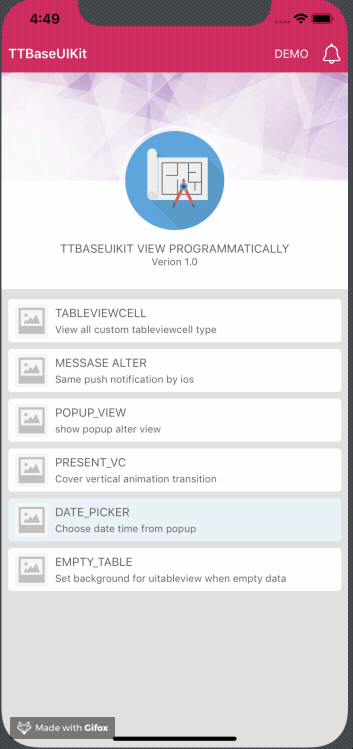

# TTBaseUIKit

Build your project with programmatically UI

[](http://cocoadocs.org/docsets/SwiftMessages)
[](http://cocoadocs.org/docsets/SwiftMessages)
[](http://cocoadocs.org/docsets/SwiftMessages)
[](https://github.com/Carthage/Carthage)

<p align="center">
  
</p>

### CocoaPods

Add the following line to your Podfile:

````ruby
pod 'TTBaseUIKit'
````

### Carthage

Add the following line to your Cartfile:

````ruby
github "tqtuan1201/TTBaseUIKit"
````

### Manual

1. Put SwiftMessages repo somewhere in your project directory.
1. In Xcode, add `TTBaseUIKit.xcodeproj` to your project.
1. On your app's target, add the SwiftMessages framework:
   1. as an embedded binary on the General tab.
   1. as a target dependency on the Build Phases tab.
## Usage example

A few motivating and useful examples of how your product can be used. Spice this up with code blocks and potentially more screenshots.

### Basics

Config setting in AppDelegate
````swift
        let view:ViewConfig = ViewConfig()
        view.viewBgNavColor = UIColor.getColorFromHex.init(netHex: 0xC41F53)
        
        let size:SizeConfig = SizeConfig()
        let font:FontConfig = FontConfig()
        
        TTBaseUIKitConfig.withDefaultConfig(withFontConfig: font, frameSize: size, view: view)?.start(withViewLog: true)
        
        self.window = UIWindow(frame: UIScreen.main.bounds)
        self.window!.rootViewController = UINavigationController.init(rootViewController: YourViewController())
        self.window!.makeKeyAndVisible()

````
<p align="center">
  
</p>

Custom show message

````swift
        let noti:TTBaseNotificationViewConfig = TTBaseNotificationViewConfig(with: window)
        noti.setText(with: "WELCOME ^^", subTitle: "Just demo little element ui with write by  programmatically swift")
        noti.type = .NOTIFICATION_VIEW
        noti.touchType = .SWIPE
        noti.notifiType = .SUCCESS
        noti.onShow()
````

<p align="center">
  
</p>

Custom show popup

````swift
            let popupVC = TTPopupViewController(title: "SOMETHING LIKE THIS", subTitle: "Lorem Ipsum is simply dummy text of the printing and typesetting industry. Lorem Ipsum has b", isAllowTouchPanel: true)
            self.present(popupVC, animated: true)
````


Set show nodata for uitableview

````swift
            self.tableView.setStaticBgNoData(title: "NO DATA", des: "Contrary to popular belief, Lorem Ipsum is not simply random text. It has roots in a piece of classical Latin literature from 45 BC, making ") {
                print("Touch handle!!!!")
            }
````
<p align="center">
  
</p>


_For more examples and usage, please refer to example project [TTBaseUIKitExample]_

## Meta

Truong Quang Tuan – [@website](https://12bay.vn) – truongquangtuanit@gmail.com

Distributed under the XYZ license. See ``LICENSE`` for more information.

[https://github.com/tqtuan1201/TTBaseUIKit](https://github.com/tqtuan1201/)


## About my project
We build high quality apps! [Get in touch](http://www.12bay.vn) if you need help with a project.

## License

TTBaseUIKit is distributed under the MIT license. [See LICENSE](./LICENSE.md) for details.
